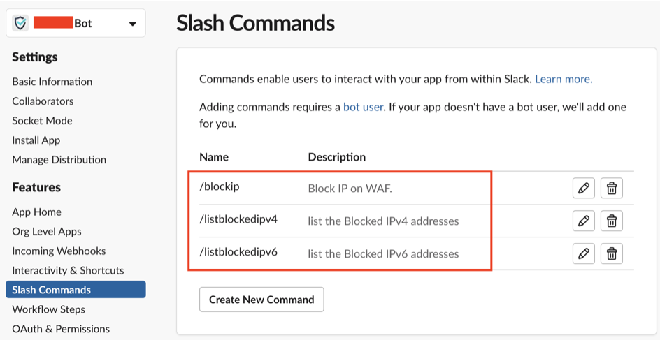
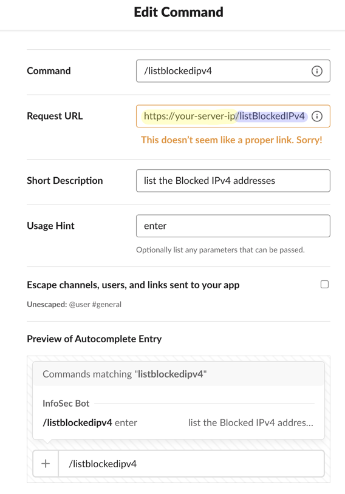

## Description

This project integrates AWS WAF (Web Application Firewall) with Slack, enabling real-time access to WAF IP Sets and adding an IPv4/IPv6 to a given IP Sets. This integration facilitates immediate awareness and response to potential security threats, enhancing your web application's security posture by utilizes the slack's `Slash Command` feature to to interact with the back-end application and uses `boto3` to interact with AWS WAF.

## Features

- Block IPs directly from Slack using a slash command. This eliminates the need to access the AWS WAF console manually.
 
- Easily view the list of blacklisted IPs(as per your requirement) within Slack itself.
- IPs can be blocked with an expiration time. 
For example, by using the slash command `/blockip 162.247.74.206/32 0 0 0 60` in your Slack channel, the IP `162.247.74.206` will be blocked for 60 seconds. Once the time expires, the IP will be automatically removed from AWS WAF.

## Slash Command Format: 
The slash command should be provided in the following format:
```
 `/blockip [IPv4inCIDR or IPv6inCIDR] [Days] [Hours] [Minutes] [Seconds]`
  /listblockedipv4 
```
eg: If you want to block an IPv4 for a day.
- `/blockip 162.247.74.206/32 1 0 0 0 `

If you want to block an IPv6 for 6 hours.
- `/blockip 2606:54c0:7680:d28::1d3:53/128 0 6 0 0 `

## Prerequisites
Before using the application, ensure you have the following:

- AWS account with read and write access to AWS WAF. 
- AWS cli setup.
- Slack workspace with administrative access. 
- Need a `Slack webhook url`.
- Python 3.x installed on your local machine.

## Initial setup
To set up and use the AWS WAF Slack Integration, follow these steps:

1. Clone this repository to your local machine using the following command:
```
git clone https://github.com/abhiunix/aws_waf_slack_integration.git & cd aws_waf_slack_integration & touch .env

```
2.  Install the required Python packages by running the following command:
```
pip3 install -r requirements.txt
```
3. Configure the AWS credentials on your local machine, either by configuring the AWS CLI or by setting the `aws_access_key_id` and `aws_secret_access_key` environment variables.


5. Create a incoming webhooks url for your channel.


6. Now create a `.env` file (if not present already) Update it with your slack webhooks.
```
webhook_url=https://hooks.slack.com/services/abc/xyz
```
7. Now create a Slash Command from Slack api


8. Replace `your-server-ip` and set the request URL to the URL where your Flask application is running. You can use [ngrok](https://ngrok.com/) to expose your local development server to the Internet with minimal effort.


9. Start the Flask application by executing the following command:
```
python3 app.py
```
10. In your Slack, you have to goto the same channel for which you created the webhook and enter the command `/listblockedipv4` e.g:
```
 /listblockedipv4 
```
11. Now you will notice that you're getting some `json data` in your console, where you have run the app and in your slack channel you'll see `You are not authorized to perform this actions.`
Now from the data you obtained from the console, you're supposed to change the `user_name`, `team_domain`, and `channel_name` value in line number `32` and `54` (in app.py file)
```
if user_name == "replace_with_user_name__from_console" and replace_with_team_domain == "replace_with_team_domain_from_console" and channel_name == "replace_with_channel_name_from_console":
```

After all those steps, you're ready to go.

You can now use the defined slash commands in Slack to block and list IPs.

## Upcoming Features
- [x] IPv6 Support: Support for blocking and managing IPv6 addresses in addition to IPv4.
- [ ] Anomaly detection.

## Contributing
Contributions to this repository are welcome! If you encounter any issues or have suggestions for improvements, please open an issue or submit a pull request.

